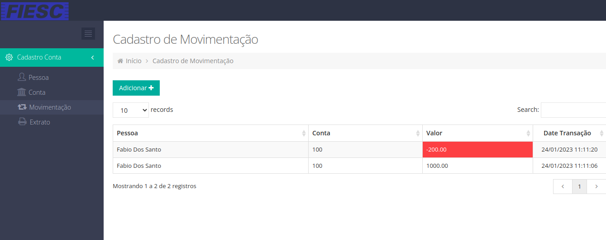

# Projeto MVC Codeigniter

 
**Cadastro de pessoa**

**Cadastro de conta**

**Cadastro de movimentação**

**Tela do sistema**

## Configuração do Projeto

O projeto utiliza docker para criar um ambiente de desenvolvimento necessário, utilizando **PHP** e **MySql**.

Necessário instalar o docker: https://www.docker.com/get-started

O banco de dados `ist` com a tabela `pessoas` será criado automáticamente via docker, na hora que subir o projeto.
Mas cabe a você a estruturação e criação das demais tabelas, conforme modelado nos protótipos acima.
O script SQL de criação das demais tabelas necessárias para o projeto, deve ser adicionados no arquivo `db/ist.sql`.

Após o clone do projeto no **GitHub**, ir via terminal na pasta extraida e executar o comando do docker: `docker-compose up`.

**Atenção:** Se atentar que não pode haver nenhum serviço rodando nas portas `80` e `3306` no computador utilizado para a realização da prova, se tiver, será necessário fechar todos os serviços que utilizam essas portas.

